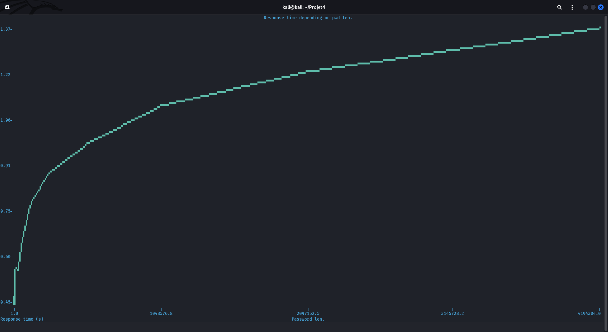

# long_pwndos

A little python script to test if WebApp are vulnerables to long password attack


## Info

This script attempt to test if an endpoint is vulnerable to long passwords attacks.
Long password (usually + 1.000.000 char) can cause errors and temporary DoS if the cryptographic function responsible for hashing them is not correctly implemented.

This script use the POST method, so if the login/register page requires GET method, you'll need to make some adjustments.

## Installation

Clone the repository & install dependecies :

```sh
git clone https://github.com/fj016/long_pwndos.git
cd long_pwndos/
pip3 install -r requirements.txt
```

## Usage

- First, you need to isolate your POST data on burp by trying to log-in/register to the targeted website.
- Put your post data in the gen() function. (Leave the k variable in the password)
- Paste the url in the 'url' field.
- Change the increment value for the one that best suits your application.
- Lauch the script :

```sh
python3 long_pwdos.py
```

## Analyzing the graph data

After some minutes (or hours, depending on increment, target, speed etc...) you'll see if the graph stays constant or has just a little variation, the target isn't vulnerable.

If there is big variations between the beginning and the end, then target may be vulnerable to Long password DoS




